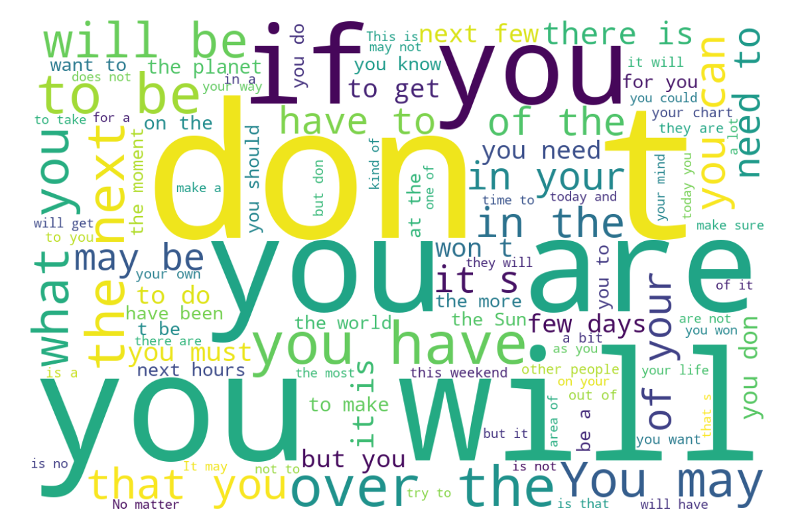
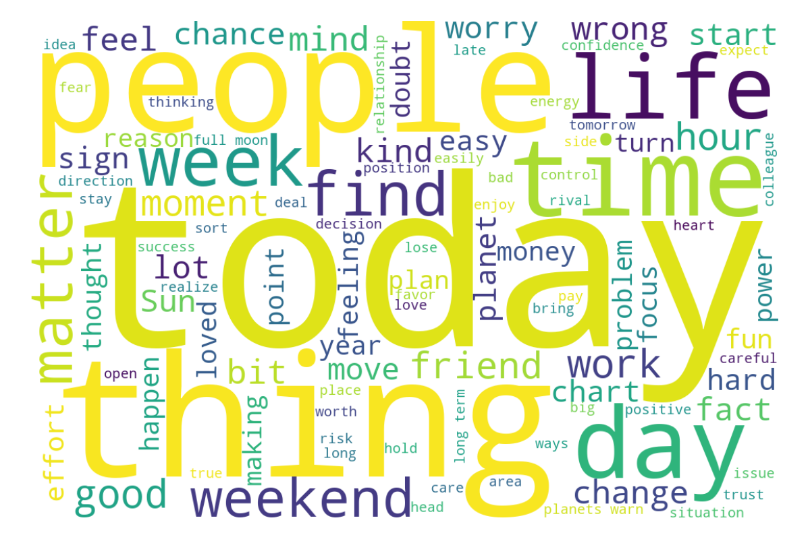
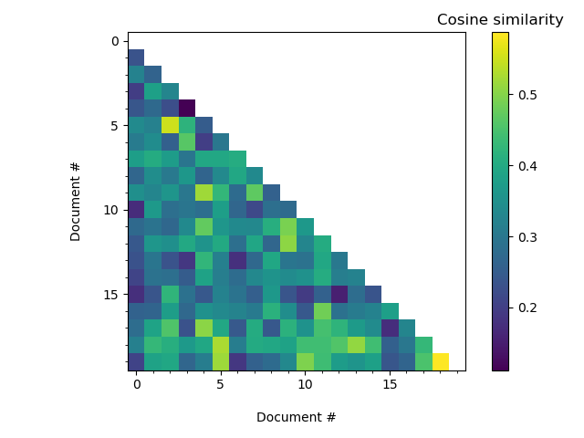

# Assignment 2: Word Importance

**Programming for the Humanities E23.**

>Daniel Lundgaard 202004134@post.au.dk
>Individual submission.

## 1. With or without function words

**[Proposed solution](./problem_01.py)**

Stopwords lifted from `src/word_importance`

With stopwords                                       | Without stopwords                                 |
:---------------------------------------------------:|:-------------------------------------------------:|
 |   |

<b>Stopwords</b>

a about above after again against ain all am an and any are aren aren't as at be because been before being below between both but by can couldn couldn't d did didn didn't do does doesn doesn't doing don don't down during each few for from further had hadn hadn't has hasn hasn't have haven haven't having he her here hers herself him himself his how i if in into is isn isn't it it's its itself just ll m ma me mightn mightn't more most mustn mustn't my myself needn needn't no nor not now o of off on once only or other our ours ourselves out over own re s same shan shan't she she's should should've shouldn shouldn't so some such t than that that'll the their theirs them themselves then there these they this those through to too under until up ve very was wasn wasn't we were weren weren't what when where which while who whom why will with won won't wouldn wouldn't y you you'd you'll you're you've your yours yourself yourselves could he'd he'll he's here's how's i'd i'll i'm i've let's ought she'd she'll that's there's they'd they'll they're they've we'd we'll we're we've what's when's where's who's why's would able abst accordance according accordingly across act actually added adj affected affecting affects afterwards ah almost alone along already also although always among amongst announce another anybody anyhow anymore anyone anything anyway anyways anywhere apparently approximately arent arise around aside ask asking auth available away awfully b back became become becomes becoming beforehand begin beginning beginnings begins behind believe beside besides beyond biol brief briefly c ca came cannot can't cause causes certain certainly co com come comes contain containing contains couldnt date different done downwards due e ed edu effect eg eight eighty either else elsewhere end ending enough especially et etc even ever every everybody everyone everything everywhere ex except f far ff fifth first five fix followed following follows former formerly forth found four furthermore g gave get gets getting give given gives giving go goes gone got gotten h happens hardly hed hence hereafter hereby herein heres hereupon hes hi hid hither home howbeit however hundred id ie im immediate immediately importance important inc indeed index information instead invention inward itd it'll j k keep keeps kept kg km know known knows l largely last lately later latter latterly least less lest let lets like liked likely line little 'll look looking looks ltd made mainly make makes many may maybe mean means meantime meanwhile merely mg might million miss ml moreover mostly mr mrs much mug must n na name namely nay nd near nearly necessarily necessary need needs neither never nevertheless new next nine ninety nobody non none nonetheless noone normally nos noted nothing nowhere obtain obtained obviously often oh ok okay old omitted one ones onto ord others otherwise outside overall owing p page pages part particular particularly past per perhaps placed please plus poorly possible possibly potentially pp predominantly present previously primarily probably promptly proud provides put q que quickly quite qv r ran rather rd readily really recent recently ref refs regarding regardless regards related relatively research respectively resulted resulting results right run said saw say saying says sec section see seeing seem seemed seeming seems seen self selves sent seven several shall shed shes show showed shown showns shows significant significantly similar similarly since six slightly somebody somehow someone somethan something sometime sometimes somewhat somewhere soon sorry specifically specified specify specifying still stop strongly sub substantially successfully sufficiently suggest sup sure take taken taking tell tends th thank thanks thanx thats that've thence thereafter thereby thered therefore therein there'll thereof therere theres thereto thereupon there've theyd theyre think thou though thoughh thousand throug throughout thru thus til tip together took toward towards tried tries truly try trying ts twice two u un unfortunately unless unlike unlikely unto upon ups us use used useful usefully usefulness uses using usually v value various 've via viz vol vols vs w want wants wasnt way wed welcome went werent whatever what'll whats whence whenever whereafter whereas whereby wherein wheres whereupon wherever whether whim whither whod whoever whole who'll whomever whos whose widely willing wish within without wont words world wouldnt www x yes yet youd youre z zero a's ain't allow allows apart appear appreciate appropriate associated best better c'mon c's cant changes clearly concerning consequently consider considering corresponding course currently definitely described despite entirely exactly example going greetings hello help hopefully ignored inasmuch indicate indicated indicates inner insofar it'd keep keeps novel presumably reasonably second secondly sensible serious seriously sure t's third thorough thoroughly three well wonder

With stopwards being left in, the wordcloud is flooded by pronouns as well as simple function words, which don't do much to explicate the content of the texts.

When we remove stopwords, we find that the wordcloud is, to a great extent, populated with words relating to topics such as perception of time, social relationships, feelings and moral judgements.

## Problem 2: Sign-specific indexing

**[Proposed solution](./problem_02.py)**

To compare across three signs, I extracted "idiosyncratic" words, i.e. words that were in the top-200 most frequent words for that sign, but not for the other two signs.

>|   Rank | leo        | scorpio   | taurus   |
>|-------:|:-----------|:----------|:---------|
>|      1 | matters    | again     | coming   |
>|      2 | end        | re        | deal     |
>|      3 | through    | cannot    | Be       |
>|      4 | Leo        | That      | positive |
>|      5 | always     | mean      | being    |
>|      6 | everything | while     | Taurus   |
>|      7 | act        | changes   | move     |
>|      8 | while      | Scorpio   | both     |
>|      9 | thinking   | Try       | No       |
>|     10 | off        | loved     | This     |
>
>Example output.

Superficially, one may notice that *leo*, includes words related to things happening across time, e.g. "always", "everything". With *scorpio*, the distinguishing feature could be repeated effort and dealing with failings. For *taurus*, there seems to be a focus on state of mind, moving towards favorable states.

## Problem 3: Document similarity

**[Proposed solution](./problem_03.py)**

I extracted a random sample of 20 horoscopes and computed a cosine similarity-matrix for document combinations.

Cosine similarity scores, which are normalized, i.e. constrained to be in the range $[0, 1]$, may be used as a proxy to assess semantic similarity between horoscope texts. 

In this instance, we are comparing the texts by quantifying the degree to which two texts share  rankings of word frequency using the cosine of angles between the vector spaces spanned by rank orders.

The two most closely related horoscopes in the sample were documents 18 and 19 ($S_c = 0.59$), while documents 3 and 4 differed the most ($S_c = 0.11$).

Most similar horoscopes

Document 18

*Someone you live or work with needs your support and maybe a shoulder to cry on and being the nice Cancer you are you will do what you can to assist them It may be emotionally draining but you have been through this kind of scene many times before*

Document 19

*You are being sent certain warning signals and if you take notice of them and what they are trying to tell you then the coming week should be a lot of fun However if you ignore them you may make a mistake that is both embarrassing and costly*

Least similar horoscopes

Document 3

*There is always something to be thankful for and there is always something to look forward to so do what you have to do today with a smile on your face Your positive attitude is sure to cheer up those who are feeling sad*

Document 4

*It does not matter what life throws at you over the next few days you will handle it all with ease The Sun in your fellow Earth sign of Taurus gives you endless self confidence the kind that makes even the impossible look easy*

