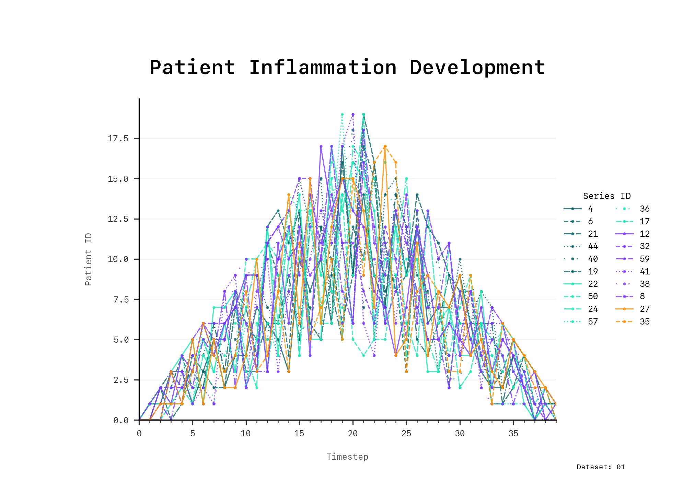
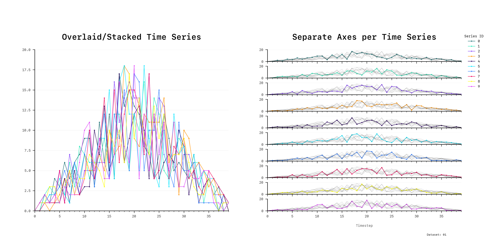

# Assignment 4: Data Visualization

**Programming for the Humanities E23**

>Daniel Lundgaard 202004134@post.au.dk
>Individual submission.

In this assignment you have to use your knowledge of modular programming and visualization in Python. The assignment consists of four problems and you have to solve a minumum of three (feel free to solve all four). For problems 1-3 you should use the series data set available [here](https://github.com/CHCAA-EDUX/Programming-for-the-Humanities-E23/tree/main/dat/series). For problem 4 use the World Happiness Survey 2021 [here](https://raw.githubusercontent.com/CHCAA-EDUX/Programming-for-the-Humanities-E23/main/dat/world-happiness-report-2021.dat). By default, the assignments assume that you use `matplotlib`, but if you prefer to use another library that is a fully acceptable solution.

## 1. Custom Plotting Function OR Class

Write a function or a class that can take a (time) series and a filename as input and generates a series visualization that is stored under the filename.

**[Proposed solution: `time_series_visualization()`](./solution.py)**

## 2. Modify Figure Properties

Modify the color and linewidth of the series visualization generated by custom plotting function of problem 1. Further more, add a title to the visualization and labels on the x and y axis. Make these parameters customizable in the custom plotting function.

Visit the [Pyplot tutorial](https://matplotlib.org/stable/tutorials/introductory/pyplot.html) for information on figure properties.

**[Proposed solution: `time_series_visualization()`](./solution.py)**

## 3. To Stack or not to Stack

In this problem you have to make two plots from at least eight series objects (rows) in one data file, e.g., [series-01.csv](https://raw.githubusercontent.com/CHCAA-EDUX/Programming-for-the-Humanities-E23/main/dat/series/series-01.csv). In the first plot, you have to stack the eight series in one plot, that is, they shold all be in the same plot window (i.e., stacked on top of each other). In the second plot, each series object should have its own subplot (i.e., a total of eight 'unstacked' subplots). Discuss the advantage/disadvantage of stacked vs unstacked plotting of series data.

**[Proposed solution: `time_series_stacking()`](./solution.py)**

>Separate plots offers better discrimination within each trajectory, but at the cost of reduced clarity as it relates to the overall pattern of the patient cohort.

## 4. Pair Plot of World Happiness Survey

Read the following columns from `world-happiness-report-2021.dat` [here](https://raw.githubusercontent.com/CHCAA-EDUX/Programming-for-the-Humanities-E23/main/dat/world-happiness-report-2021.dat) into a `pandas` dataframe: 

* _Regional indicator_
* _Ladder score_
* _Logged GDP per capita_
* _Healthy life expectancy_
* _Freedom to make life choices_
* _Generosity_
* _Perceptions of corruption_

Extract the data for two regions using the _Regional indicator_  column from the dataframe and create a `pairplot` using `seaborn` that compares the two regions. You can choose any two regions you like, but the resulting plot should look similar to this:

|  |
|:--:|
| *A `seaborn` `pairplot` for `'Central and Eastern Europe'` and `'Western Europe'` in the `world-happiness-report-2021.dat` data set* |

**[Proposed solution: `regions_pairplot()`](./solution.py)**

>`seaborn` `pairplot` for `Western Europe`, `South Asia` in the *World Happiness Report 2021*-dataset.
